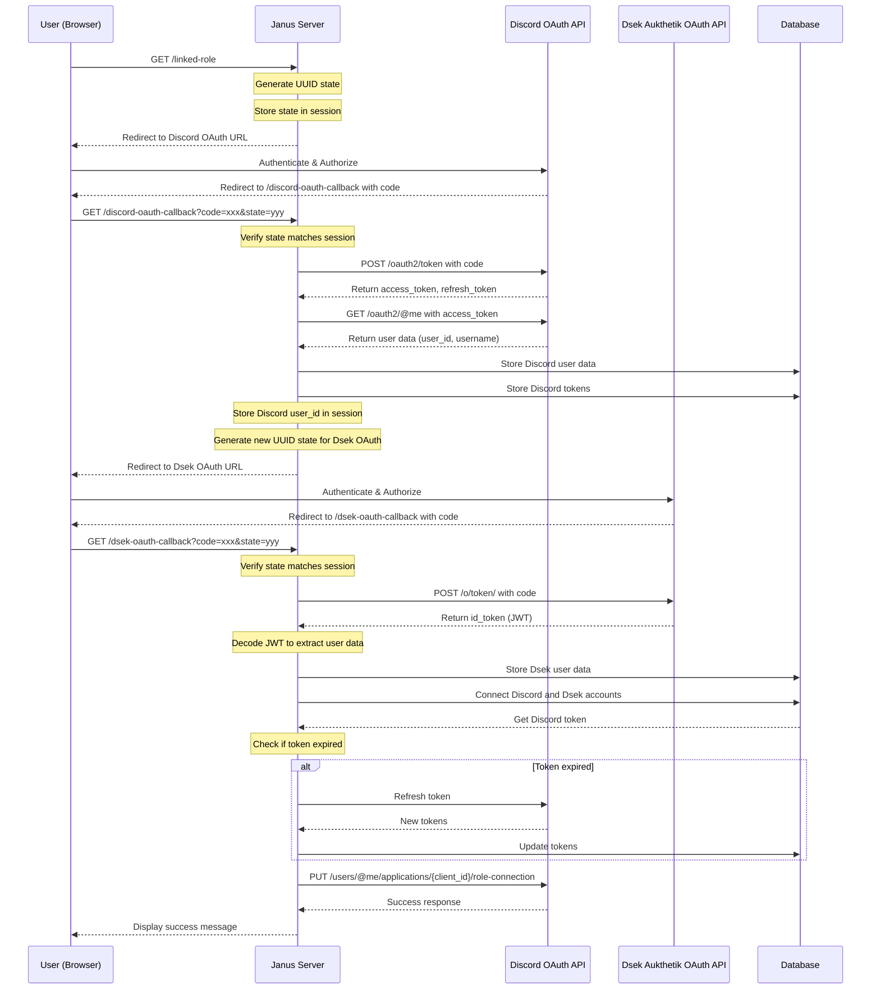

# Janus

Service to link Discord accounts with [Dsek](https://dsek.se) accounts using [Linked Roles](https://support.discord.com/hc/en-us/articles/8063233404823-Connections-Linked-Roles-Community-Members)

## Setup (with podman compose)

1. Copy example.env to .env and fill it in
2. Configure the bot in Authentik and on the discord developer portal
3. Run `podman run -it janus /janus -r` to register the bot (this
   configures the discord application. If this has already been done you can
   skip this step).
4. Run `podman run -it --network host  --env-file ./.env janus /janus -s` to
   set up the database.
5. Run `podman compose up` to get the database and the bot up and running.

It is recommended to use [ngrok](https://ngrok.com) to properly forward traffic
whilst testing.

## Sequence diagram

The app performs a double OAuth flow (first to Discord, then to
Dsek/Authentik). Shown below is the sequence diagram for the flow, including
storage of tokens and user info in the database.

## TODOs

- [ ] Better (read: existing) logging
- [ ] Better error messages (probably using [anyhow](https://docs.rs/anyhow/latest/anyhow/)?)
- [x] SQLite -> Postgres
- [ ] Fix containerfile so dependencies can be cached and not rebuild every time.
