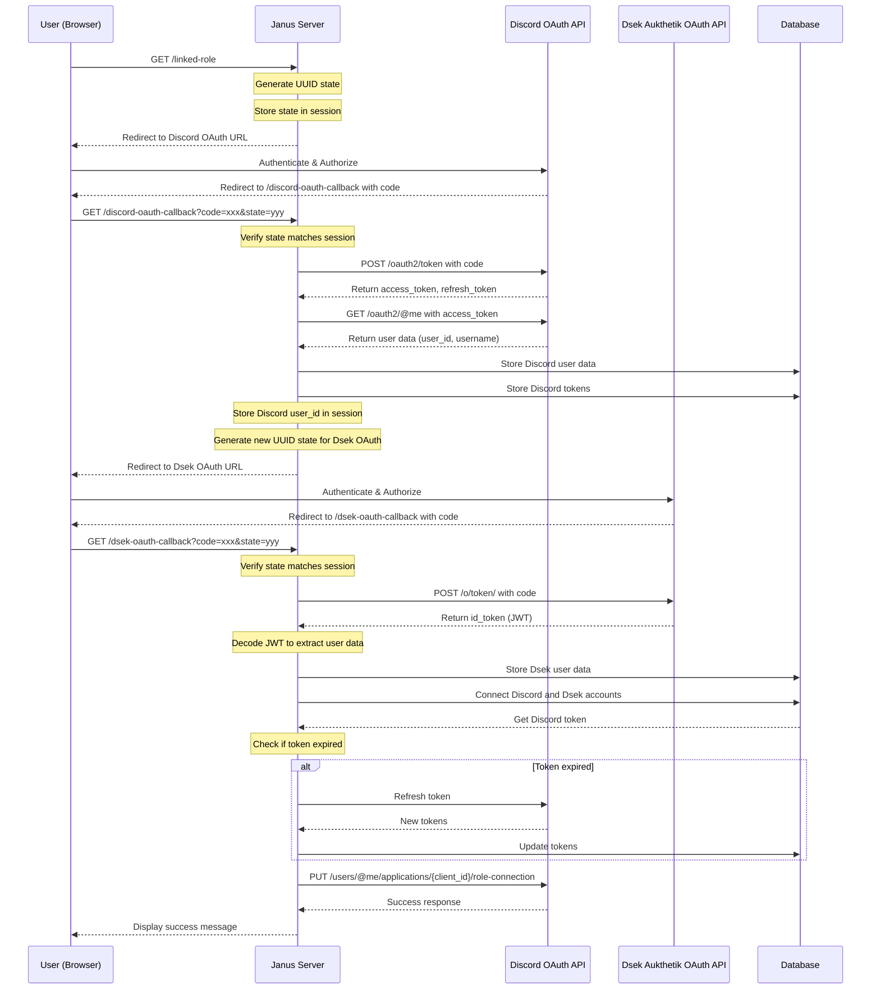

# Janus

Service to link Discord accounts with [Dsek](https://dsek.se) accounts using [Linked Roles](https://support.discord.com/hc/en-us/articles/8063233404823-Connections-Linked-Roles-Community-Members)

## Setup

1. Use Rust nightly
2. Initialize sqlite database with `sqlite3 database.db < tables.sql`
3. Populate the example.env file with info from your discord app and rename it to .env

It is recommended to use [ngrok](https://ngrok.com) to properly forward traffic whilst testing.

## Sequence diagram

The app performs a double OAuth flow (first to Discord, then to
Dsek/Authentik). Shown below is the sequence diagram for the flow, including
storage of tokens and user info in the database.

## TODOs

- [ ] Better (read: existing) logging
- [ ] Better error messages (probably using [anyhow](https://docs.rs/anyhow/latest/anyhow/)?)
- [ ] SQLite -> Postgres
